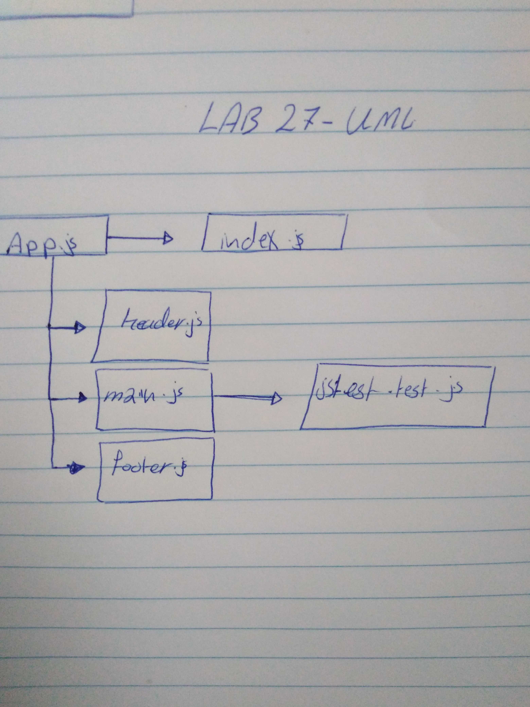

# lab27-React-Testing-and-Deployment
Write Unit and Acceptance tests for your Counter application; Deploy to the cloud

# react-test-deploy

# LAB - Class 27

### Author: sohad Qtaitat

### Links and Resources

- [submission PR](https://github.com/401-advanced-javascript-sohad/lab27-React-Testing-and-Deployment/pull/1)
- [Deploy React App](https://401-advanced-javascript-sohad.github.io/lab27-React-Testing-and-Deployment/https://401-advanced-javascript-sohad.github.io/lab27-React-Testing-and-Deployment/)
- [Javascript Tests](https://github.com/401-advanced-javascript-sohad/lab27-React-Testing-and-Deployment/runs/466977058?check_suite_focus=true)

### Setup
How to initialize/run your application (where applicable)
* npm run start

# UML

